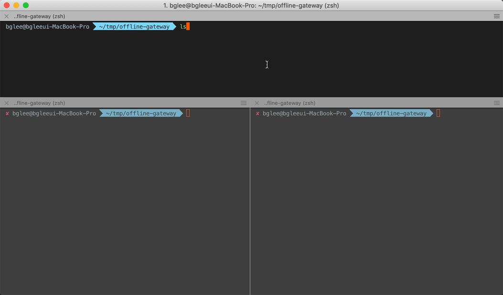

# :mushroom: Offline gateway



File based API gateway, especially `offline-gateway` DynamoDB local

```bash
npm -g i offline-gateway
```

### Usage

Define API **TYPE** and **PATH** in filename.

`METHOD.PATH1.PATH2.PATHN.js`

```bash
touch {post,get}.user.js
```
and write code

```bash
bat {post,get}.user.js
```

```text
───────┬──────────────────────────────────────────────────
       │ File: post.user.js
───────┼──────────────────────────────────────────────────
   1   │ module.exports = (event, context, callback) => {
   2   │   return {
   3   │     statusCode: 201,
   4   │     body: 'Created',
   5   │   }
   6   │ }
───────┴──────────────────────────────────────────────────
───────┬──────────────────────────────────────────────────
       │ File: get.user.js
───────┼──────────────────────────────────────────────────
   1   │ module.exports = (event, context, callback) => {
   2   │   return {
   3   │     statusCode: 200,
   4   │     body: JSON.stringify([])
   5   │   }
   6   │ }
───────┴──────────────────────────────────────────────────
```

```bash
tree
```

```text
.
├── ...(ignoring)
├── post.user.js
└── get.user.js
```

Run `offline-gateway` or `ogw`

```bash
$ offline-gateway # or ogw
```
```text
🍄 Callgate ready to work on port 3000
```

And **USE**

```bash
http post localhost:3000/user
```

```text
HTTP/1.1 201 Created
Connection: keep-alive
Content-Length: 7
Content-Type: text/html; charset=utf-8
Date: Sun, 21 Oct 2018 17:49:06 GMT
ETag: W/"7-rM9AyJuqT6iOan/xHh+AW+7K/T8"
X-Powered-By: Express

Created
```
```bash
$ http get localhost:3000/user
```
```text
HTTP/1.1 200 OK
Connection: keep-alive
Content-Length: 2
Content-Type: text/html; charset=utf-8
Date: Sun, 21 Oct 2018 17:49:11 GMT
ETag: W/"2-l9Fw4VUO7kr8CvBlt4zaMCqXZ0w"
X-Powered-By: Express

[] 
```

#### PORT

```bash
PORT=5945 ogw
```
#### DynamoDB local stream

`touch ddb.region.port.tableName.js`

```javascript
module.exports = (event) => {
  console.log('records', event)
}
```

`offline-gateway` polling stream's(first shard, DynamoDB support only one stream) **first shard** by `1` second.

### Features

- [x] Hot reloading
- [x] DynamoDB local stream(limited, very initial version)

### License
MIT